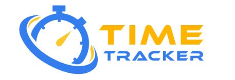
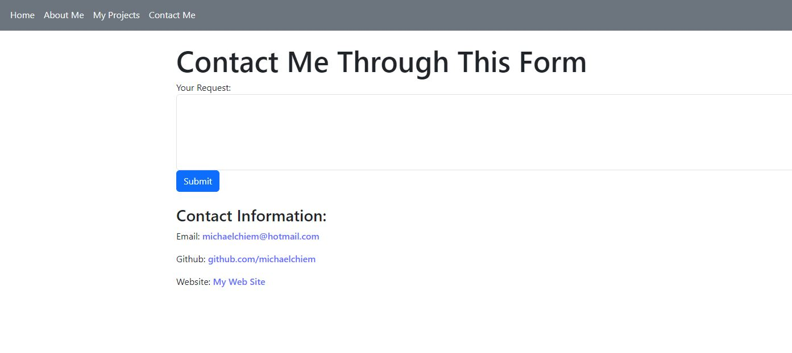

# Honolulu - Challenge 20

## Description
To create a portfolio using your new React skills, which will help set you apart from other developers whose portfolios don’t use the latest technologies. I must deploy this application to Netlify.

## Table of Contents
- [Installation](#installation)
- [Usage](#usage)
- [License](#license)
- [Contributing](#contributing)
- [Tests](#tests)
- [Questions](#questions)

## Installation
Run "npm install". After all the dependencies are installed, then run "npm run start" to launch the application. Then open the web browswer and copy this link http://localhost:3001

## Usage
Click the buttons on the  navigation bar. Each button should take you to a different page.

## License
This project is licensed under the MIT license.

## Contributing
My Tutor and ChatGPT.

## Tests
Click the buttons on the  navigation bar. Each button should take you to a different page.

## Questions
For any questions regarding the project, contact michaelchiem@hotmail.com.

[Project Link](https://github.com/Michael-Chiem/Honolulu)
